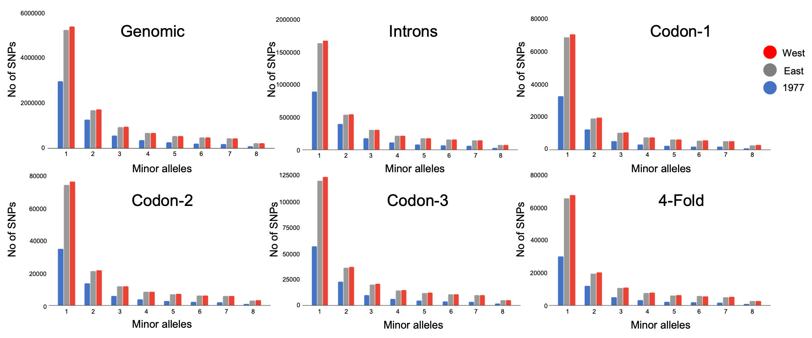
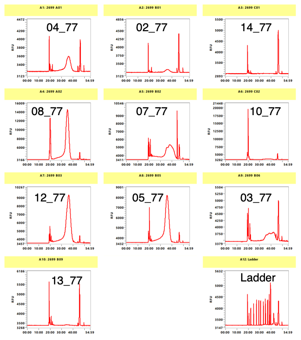

# Sampling: 
Sampling and quality summary of samples collected for this study.
|Sample | Collection date | Collection site | Sex | Depth (X) | Mapped % | Accession | Covered on the reference | Average mapping quality | Group |
|--- | --- | --- | --- | --- | --- | --- | --- | --- | --- |
|02_77 | December 11, 1977 | Sierra Chincua | M | 8.106 | 97.52 | ERS5088377 | 94.39% | 52.3812 | 1977 |
|03_77 | December 11, 1977 | Sierra Chincua | M | 10.059 | 97.8 | ERS5088378 | 94.79% | 52.4126 | 1977 |
|04_77 | December 11, 1977 | Sierra Chincua | M | 3.734 | 85.87 | ERS5088379 | 87.23% | 51.5533 | 1977 |
|05_77 | December 11, 1977 | Sierra Chincua | M | 11.797 | 98.1 | ERS5088380 | 95.08% | 52.6543 | 1977 |
|07_77 | December 11, 1977 | Sierra Chincua | M | 6.326 | 97.28 | ERS5088381 | 93.07% | 52.382 | 1977 |
|08_77 | December 11, 1977 | Sierra Chincua | M | 6.664 | 97.12 | ERS5088382 | 93.74% | 52.445 | 1977 |
|10_77 | December 11, 1977 | Sierra Chincua | M | 7.561 | 97.72 | ERS5088383 | 94.74% | 53.1072 | 1977 |
|12_77 | December 11, 1977 | Sierra Chincua | M | 27.758 | 97.15 | ERS5088384 | 95.98% | 52.5327 | 1977 |
|13_77 | December 11, 1977 | Sierra Chincua | M | 5.278 | 97.55 | ERS5088385 | 92.82% | 52.9921 | 1977 |
|14_77 | December 11, 1977 | Sierra Chincua | M | 10.59 | 93.38 | ERS5088386 | 95.82% | 53.3797 | 1977 |
|HH1 | January 1, 2015 | Halcon Hill, Oceano, CA, USA | M | 9.6237 | 98.55% | ERS3567792 | 94.92% | 52.2906 | West |
|HH2 | January 1, 2015 | Halcon Hill, Oceano, CA, USA | M | 23.8975 | 98.57% | ERS3567793 | 95.17% | 52.4082 | West |
|HH3 | January 1, 2015 | Halcon Hill, Oceano, CA, USA | M | 23.9961 | 98.61% | ERS3567794 | 95.21% | 52.3574 | West |
|HH4 | January 1, 2015 | Halcon Hill, Oceano, CA, USA | M | 11.6093 | 98.54% | ERS3567795 | 95.31% | 52.4575 | West |
|HH5 | January 1, 2015 | Halcon Hill, Oceano, CA, USA | M | 24.0058 | 98.64% | ERS3567796 | 95.20% | 52.4966 | West |
|HH6 | January 1, 2015 | Halcon Hill, Oceano, CA, USA | F | 11.9892 | 98.46% | ERS3567797 | 95.37% | 52.227 | West |
|HH7 | January 1, 2015 | Halcon Hill, Oceano, CA, USA | F | 11.3531 | 98.51% | ERS3567798 | 95.24% | 52.3522 | West |
|HH8 | January 1, 2015 | Halcon Hill, Oceano, CA, USA | F | 11.6904 | 98.58% | ERS3567799 | 95.24% | 52.3036 | West |
|HH9 | January 1, 2015 | Halcon Hill, Oceano, CA, USA | F | 24.2747 | 98.26% | ERS3567800 | 95.61% | 52.0881 | West |
|HH10 | January 1, 2015 | Halcon Hill, Oceano, CA, USA | F | 10.3024 | 98.61% | ERS3567801 | 94.96% | 52.3246 | West |
|PL1 | January 1, 2015 | Carpinteria, CA, USA | M | 22.5145 | 98.56% | ERS3567813 | 94.93% | 52.3588 | West |
|PL2 | January 1, 2015 | Carpinteria, CA, USA | M | 10.6088 | 98.36% | ERS3567814 | 95.23% | 52.2949 | West |
|PL4 | January 1, 2015 | Carpinteria, CA, USA | M | 23.3101 | 98.50% | ERS3567815 | 95.23% | 52.1309 | West |
|PL5 | January 1, 2015 | Carpinteria, CA, USA | M | 22.0154 | 98.16% | ERS3567816 | 95.14% | 52.3928 | West |
|PL6 | January 1, 2015 | Carpinteria, CA, USA | F | 22.1505 | 98.12% | ERS3567817 | 95.18% | 52.2121 | West |
|PL7 | January 1, 2015 | Carpinteria, CA, USA | F | 24.0055 | 98.57% | ERS3567818 | 95.13% | 51.9196 | West |
|PL8 | January 1, 2015 | Carpinteria, CA, USA | F | 11.9289 | 98.57% | ERS3567819 | 95.32% | 52.3541 | West |
|PL9 | January 1, 2015 | Carpinteria, CA, USA | F | 11.9053 | 98.32% | ERS3567820 | 95.25% | 52.368 | West |
|PL10 | January 1, 2015 | Carpinteria, CA, USA | F | 24.2341 | 98.59% | ERS3567821 | 95.33% | 52.2556 | West |
|ESB1 | January 1, 2015 | Esalen, Big Sur, California, USA | M | 23.2867 | 98.55% | ERS3567802 | 95.12% | 52.2363 | West |
|ESB3 | January 1, 2015 | Esalen, Big Sur, California, USA | F | 8.3722 | 98.42% | ERS3567804 | 94.53% | 51.9838 | West |
|ESB4 | January 1, 2015 | Esalen, Big Sur, California, USA | F | 11.9051 | 98.42% | ERS3567805 | 95.30% | 52.044 | West |
|ESB5 | January 1, 2015 | Esalen, Big Sur, California, USA | F | 24.1661 | 98.46% | ERS3567806 | 95.37% | 52.181 | West |
|ESB6 | January 1, 2015 | Esalen, Big Sur, California, USA | M | 23.8698 | 98.60% | ERS3567807 | 95.13% | 52.174 | West |
|ESB8 | January 1, 2015 | Esalen, Big Sur, California, USA | F | 9.5875 | 98.13% | ERS3567809 | 95.17% | 51.9442 | West |
|ESB9 | January 1, 2015 | Esalen, Big Sur, California, USA | M | 10.7981 | 98.40% | ERS3567810 | 95.22% | 52.3405 | West |
|ESB10 | January 1, 2015 | Esalen, Big Sur, California, USA | M | 8.9477 | 98.33% | ERS3567811 | 94.91% | 52.2383 | West |
|stm163 | October 1, 2009 | St. Marks, FL, USA | F | 6.7328 | 71.10% | SRR155222 | 93.36% | 51.962 | East |
|stm146 | October 1, 2009 | St. Marks, FL, USA | M | 23.0283 | 98.12% | SRR155222 | 95.86% | 51.9957 | East |
|T9 | March 30, 2009 | Texas, USA | M | 7.9529 | 87.91% | SRR154952 | 94.91% | 51.9366 | East |
|T14 | March 28, 2009 | Texas, USA | M | 9.7326 | 97.29% | SRR154952 | 95.29% | 52.1453 | East |
|NJ203 | October 1, 2009 | New Jersey, USA | F | 10.9653 | 95.55% | SRR154857 | 95.36% | 51.8747 | East |
|NJ116 | September 30, 2009 | New Jersey, USA | M | 14.8371 | 86.38% | SRR154857 | 95.31% | 51.6119 | East |
|NJ1 | September 30, 2009 | New Jersey, USA | F | 10.0711 | 95.91% | SRR154857 | 95.27% | 51.9277 | East |
|HI023 | July 3, 2008 | Massachusetts, USA | M | 11.9722 | 99.13% | SRR154857 | 94.62% | 52.436 | East |
|HI033 | August 10, 2009 | Massachusetts, USA | F | 7.0416 | 97.86% | SRR154857 | 94.01% | 52.031 | East |
|mex986 | January 9, 2007 | Sierra Chincua, Mexico | M | 9.4968 | 97.42% | SRR155220 | 95.26% | 52.1003 | East |
|mex919 | January 9, 2007 | Sierra Chincua, Mexico | M | 10.8028 | 98.43% | SRR155220 | 95.45% | 52.3629 | East |
|mex915 | January 9, 2007 | Sierra Chincua, Mexico | F | 9.8295 | 98.23% | SRR155220 | 95.27% | 52.039 | East |
|mex536 | February 11, 2008 | Sierra Chincua, Mexico | M | 9.6611 | 98.01% | SRR155220 | 95.25% | 51.9754 | East |
|mex1527 | February 13, 2008 | Cerro Pelon, Mexico | F | 7.3151 | 98.16% | SRR155220 | 94.57% | 51.9242 | East |

# Summary 

Summary of number alleles shared and private between contemporary eastern (A) and western (B) samples with historical samples. 
|1977 VS East | No of SNPs | Percentage |
|--- | --- | --- |
|Shared |	2794036 |	33.09 |
|Private 1977 | 2169855 |	25.70 |
|Private East | 3479427 |	41.21 |
|Total |	8443318	| |

|1977 VS West |	No of SNPs | Percentage |
|--- | --- | --- |
|Shared |	2805502 |	32.80 |
|Private 1977 |	2169919 |	25.37 |
|Private West |	3576891 |	41.82 |
|Total |	8552312 |	|

# Samples used
Sample IDs used for both replicates to estimate Nucleotide diversity (π), Waterson’s estimator (Θw) and Tajima's D (Td) statistics for historical samples. 
| Replicate 1 |	Replicate 2 |
|--- | --- |
| 02_77 | 02_77 |
| 03_77 | 03_77 |
| 04_77 | 05_77 |
| 05_77 | 07_77 |
| 07_77 | 08_77 |
| 08_77 | 10_77 |
| 10_77 | 12_77 |
| 12_77 | 13_77 |

# Site frequency spectrums (SFS)
Site frequency spectrum (SFS) of historical and contemporary monarchs, calculated for all the different genomic site categories. In all the site categories the historical samples showed lower numbers of SNPs at all the allele frequency classes compared to the contemporary samples. 

# bioanalyzer fragment analyzer
Outputs of bioanalyzer fragment analyzer of historical samples.  The sample ID is mentioned with in the box.

